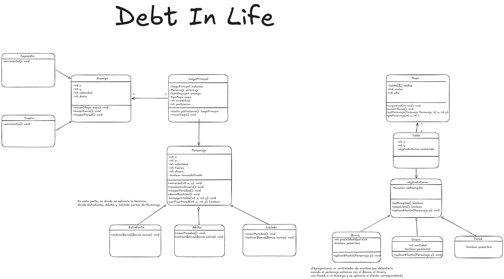

# Proyecto: Debt_In_Life

## 1. Integrantes del Equipo 

- Cabrera, David 
- Del Rio, Axel 
- Romero, Ignacio 
- Vasquez, Joaquin
## 2. Dominio y Alcance del Sistema 

## Descripción del Problema

Buscamos desarrollar un videojuego inspirado en Pac-man. El jugador debe recolectar la cantidad de puntos objetivo (Dinero), evitando los enemigos los cuales restarán puntos al jugador si los toca. La partida tendrá 3 niveles nombrados como Estudiante, Adulto y como nivel final Jubilado.

## Objetivo del Sistema

Será un juego con controles sencillos y conocidos con mecánicas básicas de un juego al estilo Pac-man. Con la particularidad de agregar variabilidad en el gameplay y una temática casual. Siguiendo las bases que identifican al paradigma de programación oriendado a objetos.

### Funcionalidades principales

## Sistema de Enemigos

-Los enemigos serán customizados como entidades que pueden restar dinero a como por ejemplo, una consola de videojuegos o impuestos.

- Los enemigos aparecen en el mapa al comenzar el nivel.

- A medida que se aumentan el nivel aparecerán más enemigos y serán más rápidos.

- Los enemigos estarán a lo largo de todo el mapa de forma aleatoria y tendrán un recorrido preestablecido para dificultar la partida al jugador.

## Mecanicas de Juego

- El jugador comenzará la partida con una cantidad ($) preestablecida en el nivel 1 (Estudiante) y deberá recolectar los puntos (Dinero) que estarán repartidos en el mapa.

- El jugador perderá la partida en cuanto sus puntos caigan por debajo de 0 y empezará desde el nivel 1.

- Habrán mejoras donde cada una será diferente dependiendo el nivel actual y que aparecerán cada cierta cantidad de dinero recolectado.

## Interfaz Grafica

- Visualización de cada nivel con un mapa, enemigos, aspecto del jugador.
El jugador es una persona  que debe evitar sumar deudas a lo largo de su vida en una perspectiva top-down, en la cual en los niveles habrán objetos o entidades que harán que el jugador vaya acumulando deudas y por lo tanto se le reste dinero. El jugador deberá recoger dinero esparcido por el mapa donde en una determinada cantidad de dinero avanzará de nivel. Además, dependiendo del nivel, el jugador podrá construir o destruir paredes a voluntad. Como también, contará con potenciadores temporales donde dependiendo del nivel, afectará de manera diferente al jugador, como por ejemplo en velocidad al moverse o inmunidad. El juego tendrá 3 niveles: Estudiante (Con un mapa ambientado en una escuela), Adulto (ambientando el mapa en una oficina) y Jubilado (ambientando el mapa en un lugar calmo y natural), a medida que se vaya avanzando en los niveles, sera mas difícil sumar dinero. Los escenarios e incluso el mismo personaje que usará el jugador serán variados dependiendo el nivel y los enemigos serán distintos, como por ejemplo un enemigo podría ser Los Impuestos, habrá enemigos que siguen al jugador y otros que avanzarán de manera aleatoria en el mapa.

Algunos conceptos de los mapas: 

Algunos conceptos de los enemigos: 

Concepto personaje estudiante: 

#### Diagrama de Clases UML (Conceptual)**
https://excalidraw.com/#room=06e19fa734b3c8b1a63a,D3CVevWOrU4yFgqbOUNB2Q

## 4. Stack Tecnológico 

- **Lenguaje:** Java 17
- **IDE:** Visual Studio Code
- **Base de Datos:** MySQL 8.0 (para persistencia de High Scores)
- **Framework de IGU:** Java Swing
- **Control de Versiones:** Git y GitHub Classroom
